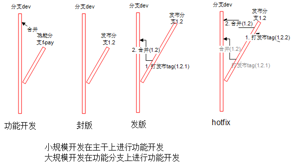

# 版本模型的最佳实践

## 最佳实践

### 原则
1. 未经测试或代码审核的，不准发生产环境
1. 构建
  1. 开发包可以是分支
  1. 其他包必须是tag打出来的包
1. 合并
  1. 功能分支谁创建的谁合并回源分支
  1. 其他合并都是负责人操作，比如发布分支到主干分支，hotfix分支到发布分支
  1. 如发布后还在发布分支的提交需通知负责人合并
  1. 采用git merge合并，尽量不要用补丁和人工合并

### 分支tag命名规范
| 类型 | 格式 | 示例 | 说明 |
| :-: | - | - | - |
| 主干/开发分支 | dev | dev | 默认分支 |
| 功能分支 | 源分支-功能说明 | dev-pay |  |
| 发布分支 | 版本 | 4.0 | 2位 |
| 发布tag | 版本 | 4.0.1 | 3位 |
| hotfix分支 | h-jira号 | h-123 |  |

### 流程
#### 封版
1. (基于主干分支)新开发布分支

#### 发版
1. (基于发布分支的测试通过后)打发布tag
1. 发布分支合并回主干
1. 基于发布tag构建包

#### hotfix
1. fix：二选一，推荐第一种
  1. 发布分支fix
  1. hotfix分支fix
    1. 基于发布分支新开hotfix分支
    1. fix后hotfix分支合回发布分支
1. “发版”

注意事项
* 不支持多个hotfix同时在发布分支操作。如有需要可开hotfix分支处理
* 发布分支上有多个hotfix，非最新hotfix版本出问题后的处理方案
  1. hotfix
  1. 打最新的tag。比如：1.2.1上发现问题hotfix后，打最新tag1.2.9

## 资料
* [主干开发模式](https://mp.weixin.qq.com/s/Q6pvLcr7S2Xct8MGtjMofA)

### 环境清单
1. 每个环境都有独立的一套：执行程序，数据库，配置

| 环境 | 分支tag | 说明 |
| :----: | ---- | ---- |
| 开发环境 | 开发分支 | 开发人员自行搭建环境 |
| 测试环境 | 发布分支 |  |
| 正式环境 | 发布tag |  |

### 主流版本模型
* 原则：新分支只能合并到来源分支(不能在新分支之间做合并)，来源分支可以将部分改进合并到新分支
* 资料：[分支模型](http://blog.csdn.net/qq_34651940/article/details/51891767)，[英文原版](http://nvie.com/posts/a-successful-git-branching-model/)。master上可能会发生多个版本混合事情【世界是个树，不是线】，不建议用master

|分支类型 | 名称 | 永久 | 命名规范 | 来源 | 操作 | 合并到 | 角色 |
| -------- | ----- | ----- | ----- | ---- |----- | ----- | ---- |
| master | 主干，正式环境 | Y | master | release，hotfix | 无 | 无 | 发布人员 |
| develop  | 开发分支，开发环境，测试环境 | Y |  dev | 无 | 任意 | 无 | 开发人员 |
| feature | 功能分支 | N |  f-pay。f-功能说明 | dev | 任意 | dev | 开发人员 |
| release | 版本发布分支 | N | 2.3。版本号 | dev | bugfix | dev | 发布人员，开发人员 |
| hotfix | 补丁分支 | N | h-332452。h-bug说明 | master | bugfix | dev | 发布人员，开发人员 |
