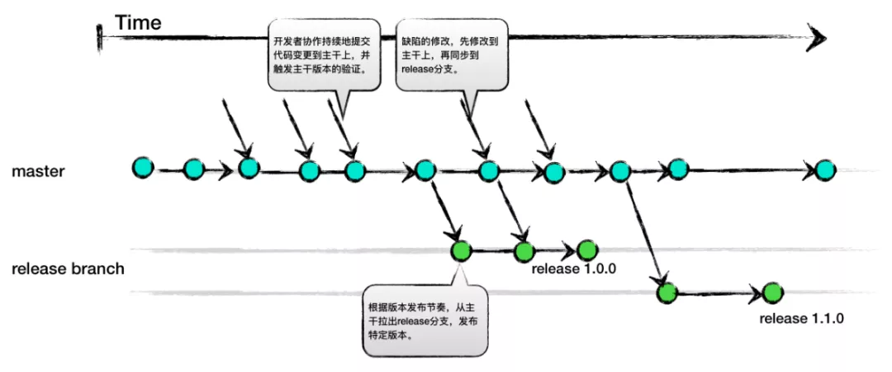
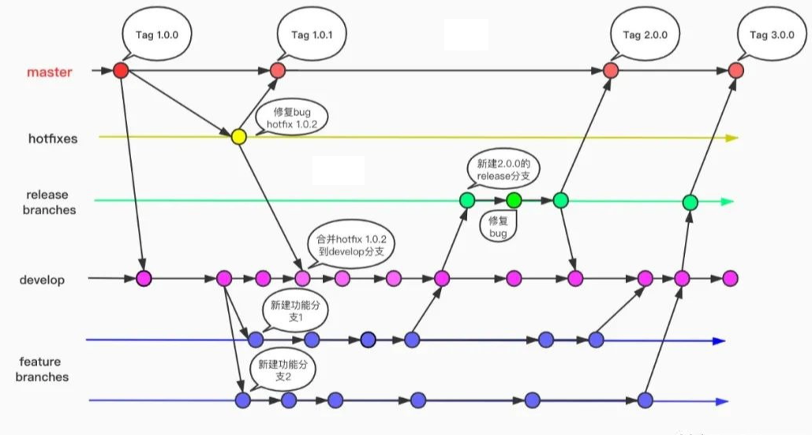
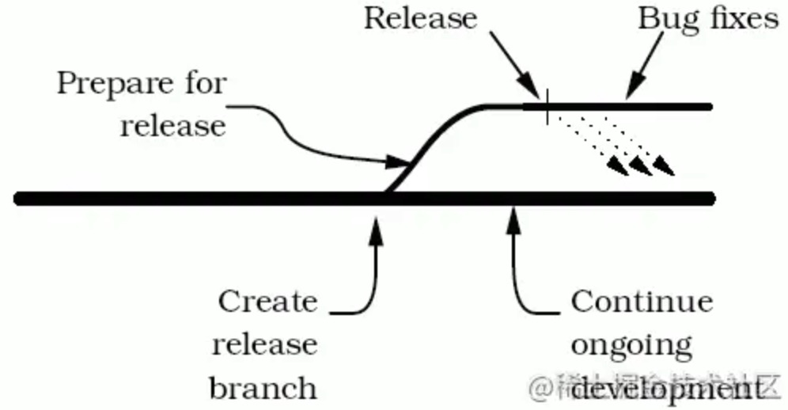
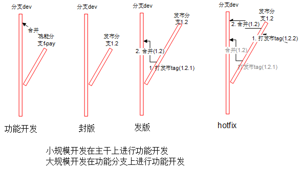

# 版本模型和最佳实践

## 开发模型
### 资料
* [TBD/Git-Flow/Github-Flow/Gitlab-Flow](https://developer.51cto.com/article/620588.html)
* [Google 和腾讯为什么都采用主干开发模式](https://mp.weixin.qq.com/s/Q6pvLcr7S2Xct8MGtjMofA)
* [特性分支开发分支模型](http://blog.csdn.net/qq_34651940/article/details/51891767)，[英文原版](http://nvie.com/posts/a-successful-git-branching-model/)

### 分析
* 互联网模式是随时有发布的版本(功能级)，非互联网版本有大版本概念(几个功能同时发版)

| 模式 | 说明 | 场景 | 优势 | 劣势 |
| - | - | - | - | - |
| TBD：主干开发（trunkbaseddevelopment.com） | 主干开发和fix，release分支发布。开发团队的成员1天至少1次地将代码提交到主干分支 | 互联网模式 && 速度优先 | 1. 随时拥有可发布的版本   2. 天然支持灰度发布以及A/B Test   3. 因为提前测试feature，所以更容易的控制feature发布   4. 更简单的版本管理 | 1. 代码评审和质量, 结对编程 |
| Git-Flow：特性分支开发（Feature Branch Development） | 质量优先   feature分支开发，dev分支集成，release分支发布，主干基线 | 非互联网模式 && 大型高质量产品 | 1. 特性开发周期宽松：因为生命期可以较长，较大的需求特性可以在宽松的时间内完成再合入主干   2. 分支测试的时间宽松：因为生命期可以较长，可以有较多时间对分支进行测试，甚至手工测试 | 1. 版本管理成本(分支合并、冲突解决) |
| Github-Flow：特性分支开发（Feature Branch Development） | feature分支开发和集成，主干发布 | 互联网模式 && 速度优先 | 不需要强大的基建，其他同TBD | 同TBD |
| Gitlab-Flow：特性分支开发（Feature Branch Development） | 开发同Github-Flow，发布有预发和发布分支 | 互联网模式 && 速度优先 | 有预发版本，其他同Github-Flow | 同Github-Flow |
| [先锋主干多稳定分支](https://juejin.cn/post/6844904197763104775)，主干开发的变种 | 主干开发，支持feature分支开发，release分支fix和发布 | 非互联网模式 && 速度优先 |  | 1. 无评审机制 |

### TBD

### Git-Flow

1. 新分支只能合并到来源分支(不能在新分支之间做合并)，来源分支可以将部分改进合并到新分支

### 先锋主干多稳定分支
1. 尽量在dev分支开发，feature可以开feature分支来开发
1. 在release分支做hotfix、tag和发布

### sprint
1. 多个sprint可以对应1个软件版本，不是每个sprint都需要发布
1. sprint处理：推荐打tag。实在要分支可以在开发分支上拉出sprint分支开发，比如Git-Flow

## 最佳实践
* 先锋主干多稳定分支

### 原则
1. 未经测试或代码审核的，不准发生产环境
1. 构建
  1. 开发包可以是分支
  1. 其他包必须是tag打出来的包
1. 合并
  1. 功能分支谁创建的谁合并回源分支
  1. 其他合并都是负责人操作，比如发布分支到主干分支，hotfix分支到发布分支
  1. 如发布后还在发布分支的提交需通知负责人合并
  1. 采用git merge合并，尽量不要用补丁和人工合并

### 分支tag命名规范
| 类型 | 格式 | 示例 | 说明 |
| :-: | - | - | - |
| 主干/开发分支 | dev | dev | 默认分支 |
| 功能分支 | f-功能 | f-pay |  |
| 发布分支 | 版本 | 4.0 | 2位 |
| 发布tag | 版本 | 4.0.1 | 3位 |
| hotfix分支 | h-jira号 | h-123 |  |

### 流程
#### 封版
1. (基于主干分支)新开发布分支

#### 发布
1. (基于发布分支的测试通过后)打发布tag
1. 发布分支合并回主干
1. 基于发布tag构建包

#### hotfix
1. fix：二选一，推荐第一种
  1. 发布分支fix
  1. hotfix分支fix
    1. 基于发布分支新开hotfix分支
    1. fix后hotfix分支合回发布分支
1. “发布”

注意事项
* 不支持多个hotfix同时在发布分支操作。如有需要可开hotfix分支处理
* 发布分支上有多个hotfix，非最新hotfix版本出问题后的处理方案
  1. hotfix
  1. 打最新的tag。比如：1.2.1上发现问题hotfix后，打最新tag1.2.9

### 环境清单
1. 每个环境都有独立的一套：执行程序，数据库，配置

| 环境 | 分支tag | 说明 |
| - | - | - |
| 开发环境 | 开发分支 | 开发人员自行搭建环境 |
| 测试环境 | 发布分支 |  |
| 正式环境 | 发布tag |  |
