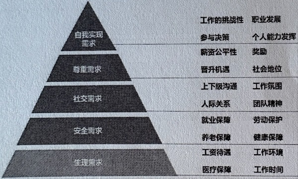

# 招聘
## 能力
> 能力核心构成 = 能力(智力、认知能力、自学能力) + 水平(认知水平、知识经验)。所有之间相互影响、相互促进的动态闭环关系

| 能力层 | 内容 | 说明 |
| - | - | - |
| 硬能力 | 知识(知道)   技能(能做好)   经验(做过) | 知识经验 |
| 软能力 | 个性(为人)：责任心、自驱、积极主动、能承受高压力   行为能力(处事)：沟通、逻辑、团队合作 | 为人处事 |
| 内核 | 价值观，愿景目标 | 行为、方向和动力的驱动来源 |

### 需求金字塔

## 招聘
* 启动到录用40天

### 招聘标准
* 要求：完整，清晰，合理
* 内容来源
    1. 业务发展要求
    1. 内部团队分析：通过公司内好员工总结出成功画像
    1. 岗位要求
    1. 标杆企业和同行的招聘和薪酬标准

### 面试
* 要有打分项及其打分标准
* 提问：实际事件STAR(情境，任务，行为，结果)，事件要和能力相关，讲事件细节和那时的思考和行为

| 问题 | 考察点 | 说明 |
| - | - | - |
| 分享下你工作中印象最深刻的经历。内容没有限制，有成就有价值的、积累的经验、踩过的坑 | 主动思考，思考方式和方向，平时思考整理的习惯；硬能力和软能力 | 这问题可以问多次，直到了解软硬能力为止。**需要面试官经验丰富，能听懂内容能判断事件真实性** |
| 分享下你工作中遇到的最大挑战 | 同上 | 可以细化到某个具体方向的挑战，比如技术难点 |
| 你的职业规划 | **内核** |  |

* 测评工具(调查问卷)：个性，认知，动机价值观
* 离职入职动机分析

### 普通员工打分表
| 项 | 说明 | 占比(100) |
| - | - | - |
| 责任 | 工作态度【认真靠谱】；自我驱动；承担压力 | 20 |
| 工作方式 | 目标导向，先调研在做；长期耐心；团队合作 | 20 |              
| 能力 | 自我学习；思维逻辑能力；语言表达和沟通 | 30 |
| 专业知识 |  | 20 |
| 行业知识 |  | 10 |

### 面试评估
* 分析并决策：能力，潜力，动机，薪酬。团队互补。优劣势，业务现在和未来的需要