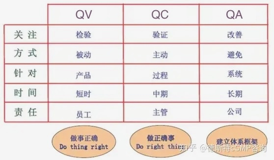

# 质量管理体系(QMS)
> 质量不是检测出来的，是通过质量管理体系生产出来的

* QE(Quality Engineering/质量工程): 全面的质量控制过程，涵盖了从产品设计到生产，再到产品使用和服务的全过程。质量工程师通常会使用各种工具和方法来预防和解决质量问题
* 记录真实、准确、完整和可追溯

## 体系文件
* 第一层是金字塔顶

| 层 | 名称 | 说明 |
| :-: | - | - |
| 第一层 | 质量手册 | 公司层面的指导。含方针、要求等 |
| 第二层 | 程序文件 | 程序说明，不涉及具体操作 |
| 第三层 | 管理制度、标准操作规范 | 具体操作 |
| 第四层 | 记录文件 | 活动流程的过程记录 |

## 质量控制和检测
| 质量控制项 | 名称 | 职责 | 目标 |
| - | - | - | - |
| IQC | 进料质量控制(Incoming Quality Control) | 外购原材料、零部件、组件的质量符合性，拦截不合格来料 | 确保所有进入生产过程的物料都符合质量标准 |
| PQC | 过程质量控制(Process Quality Control) | 生产过程中进行的质量检查，确保制造过程的每一步都符合质量标准。   监控生产过程关键工序质量，预防批量不良，确保工艺合规。 | 通过持续监控和调整生产过程来预防质量问题的发生 |
| IPQC | 过程中质量控制(In-Process Quality Control) | 生产过程中进行的质量检查，生产过程中的实时监控和调整 | 目标是确保制造过程的每一步都符合质量标准 |
| FQC | 最终质量控制(Final Quality Contro) | 产品完全制造完成后进行的质量检查，确保产品符合规定的质量标准和客户的需求。   检验完工成品的外观、功能、性能，确认符合产品技术要求 | 在产品出厂前发现并修复任何缺陷 |
| OQC | 出货质量控制(Outgoing Quality Control) | 产品完全制造完成并准备发货时进行的质量检查。   复核成品包装、标签、UDI 标识、随附文件，确认可安全放行 | 确保发往客户的产品符合规定的质量标准和客户的需求 |

| 质量检验项	| 对应控制 | 执行时机 | 关键文档 | 关键记录 |
| - | - | - | - | - | - |
| 来料检 | IQC | 物料入库前	 | 检验规程 | 来料检验报告 |
| 过程检 | IPQC | 生产工序流转中（首件、巡检、末件） | 工艺卡、作业指导书（SOP） | 首件检验记录、巡检记录表 |
| 成品检 | FQC | 成品入库前	 | 成品检验规程 | 成品检验报告、功能测试记录 |
| 出厂检 | OQC | 成品出库前	 | 出库检验规程 | 出厂检验报告 |

## 角色

| 项 | 一句话 | 岗位 | 工作内容 |
| :-: | - | - | - |
| QV(Quality Verification/质量验证) | 验证产品 | 产品测试工程师 | 产品符合质量标准，包括产品检查和验证 |
| QC(Quality Control/质量控制) | 执行体系 | 质量控制工程师 | 在生产过程中采取措施以确保产品质量，包括生产过程中的各个阶段的监控、检查和纠正。   执行各种质量检查活动：质量保证，设计验证方案、测试报告输出，体系文档审核、配置管理审核 |
| QA(Quality Assurance/质量保证) | 建设体系 | 质量体系工程师 | 规划、实施和监控质量体系，确保产品或服务的质量符合要求。   强调预防性措施，以确保质量问题不会发生，而不是仅仅依靠检查和纠正问题。 |

## 法规标准
| 项 | 说明 |
| - | - |
| [ISO27001 信息安全管理体系](https://www.secrss.com/articles/18682) | 信息安全管理体系规范，信息安全管理实施规则 |
| YY/T 0664-2020 医疗器械软件 软件生存周期过程 |  |

## 风险
### 风险评价准则
| 概率/严重程度	| 灾难性 | 致命 | 中度 | 轻度 |
| - | - | - | - | - |
| 经常 | U | U | U | R |
| 有时 | U | U | R | R |
| 偶然 | U | R | R | R |
| 很少 | R | R | R | A |
| 非常少 | R | R | A | A |
| 极少 | R | A | A | A |

>说明：
A：可接受的风险
R：合理可行降低(ALARP)的风险
U：不经过风险／ 收益分析即判定为不可接受的风险

## 质量评价
1. 产品质量是软件产品本身的质量评价
    1. 功能性
    1. 性能效率
    1. 兼容性
    1. 易用性
    1. 可靠性
    1. 信息安全性
    1. 维护性
    1. 可移植性
1. 使用质量是指定用户使用产品或系统满足其要求的程度，以达到在指定的使用周境中的有效性、效率和满意度等指定目标。
    1. 有效性
    1. 效率
    1. 满意度
    1. 抗风险
    1. 周境覆盖

## 资料
* [CAPA，质量管理体系的生命力](https://zhuanlan.zhihu.com/p/375906048) : Corrective Action and Preventive Action/纠正和预防措施
* [CAPA实施的八大步骤](https://zhuanlan.zhihu.com/p/451241044)
* [人机料法环](https://zhuanlan.zhihu.com/p/134621727):质量管理理论中的五个影响产品质量的主要因素
* [BOM类型](https://zhuanlan.zhihu.com/p/430704814)
* 过程确认: IQ(安装)，OQ(操作)，PQ(性能)
* [医疗器械注册](https://medical.wangyaqi.cn/#/reg/SUMMARY)