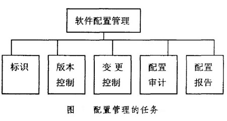
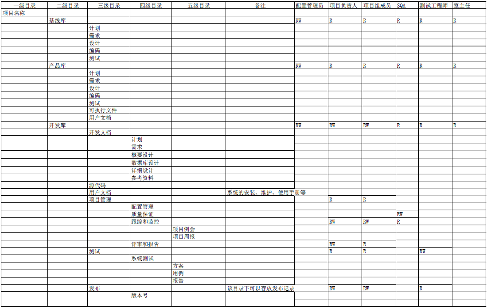

# 配置管理
* 每个行为有流程(确保结果正确一致)，每个配置项可追溯
* cm是全流程管理，通过单点登录打通所有研发效能平台(jira/git/制品库等)

## 介绍
1. 在整个软件产品的生命周期内通过对配置项标识、基线变更、版本发布、配置现状报告、配置审计等各项配置活动的有效管理
1. 建立和维护软件产品完整性（一致性、完备性、正确性）
1. 最大限度地减轻在软件开发和过程中由于客户在产品功能、工期和预算上的变化而对开发产品质量、项目工期和开发成本所造成的影响

### 重点
* 不是所有的注册文件都需要配置管理
* 每个配置项都有阶段有基线
* 测试报告和测试记录合成一个配置项，测试一轮测试记录多一个，配置项版本递增

### 术语
| 项 | 英文 | 说明 |
| :-: | - | - |
| CCB | Configuration Control Board | 配置控制委员会 |
| 配置项 | Configuration Item |  |
| 开发库 | Development |  |
| 受控库 | Baseline |  |
| 产品库 | Product |  |
| 基线 | Configuration Baseline |  |
| 基线审计 |  |  |
| 配置管理报告 |  |  |

### 流程和产出
| 编号 | 活动 | 说明 | 文档输出 |
| :-: | - | - | - |
| 1 | 策划配置管理活动 | 项目初期，同步项目开发计划制定CM计划，计划是对整个CM活动的策划、计划；包括：配置库建立计划、备份计划、基线建立计划、审计计划等 | 配置管理计划 |
| 2 | 建立和维护配置库 | 项目初期，根据CM计划，建立项目配置库的物理结构和相应的控制权限；比如：开发库、受控库及设定权限；另外配置库需要定期备份 | 配置库目录 |
| 3 | 识别和标识配置项 |  | 配置库目录 |
| 4 | 建立和发布基线 | 基线建立流程：PM提申请-CCB审核-CM执行-基线建立-基线检查（审计）-基线发布   基线内容的变更必须经过正式的变更控制程 | 纳入基线申请，功能配置审计报告，物理配置审计报告，基线发布报告 |
| 5 | 基线（配置）审计 | SQA审计 | 功能配置审计报告，物理配置审计报告 |
| 6 | 配置项变更控制 | 1.	对不进基线的配置项按权限进行变更   2.	对进基线管理的配置项按照基线变更流程处理 | 配置项状态报告 |
| 7 | 配置项状态跟踪 | CM建立配置项状态报告-定期审查-解决并跟踪问题 | 配置项状态报告 |
| 8 | 产品发布 | PM提交产品发布申请-CM对发布对象进行检查-提取可交付的产品-审计-PM确定产品不发时间-发布产品 | 产品发布申请单，产品发布公告 |
| 9 | 报告 |  | 配置管理报告 |

## 配置项
* CM管理的最小单位，有编号和版本
* 根据配置管理计划中识别配置项的准则，选择配置项和相关的工作产品或组件，赋予固定ID。[如需求/安装包的链接等]

### 组成
1. 产品组成部分的工作成果：需求、设计、源代码、测试用例、测试结果、接口描述、工具（如编译器）等
1. 项目管理和机构支撑过程域产生的文档：计划、状态报告等

### 状态
| 状态 | 说明 |
| :-: | - |
| 未控 | 还没有建立或确认 |
| 受控 | 该配置项已确认（经过评审或正式版本） |
| 基线 | 放入受控库 |
| 变更 | 正在变更 |

## 配置库
* 角色：项目成员(产品经理，开发，测试，实施)、配置管理员、质量注册工程师，生产工程师，相关授权人员
### 目录结构的内容和权限

| 一级目录 | 二级目录 | 文档输出 | 说明 |
| :-: | - | - | - |
| 01.plan |  | 《项目计划》，《项目定义过程》，《项目估算表》，《项目进度计划》，《配置管理计划》 |  |
| 02.req |  |  |  |
|  | 01.需求调研 | 《需求调研计划》，《需求调研报告》	 |  |
|  | 02.需求分析 | 《需求规格说明书》(PRD)，《产品功能列表》，《需求跟踪矩阵》 |  |
|  | 03.需求变更 | 《需求变更单》，《需求变更跟踪》，《需求变更报告》 |  |
| 03.design |  |  |  |
|  | 01.概要设计 | 《概要设计说明书》 |  |
|  | 02.详细设计 | 《详细设计说明书》，《数据库设计说明书》 |  |
| 04.code |  | 代码，构建脚本和构建物，安装包	 |  |
| 05.test |  | 测试用例，《测试问题报告》，《集成&确认测试计划》，《集成&确认测试报告》 | 项目单元测试和集成测试所需要的工作产品和测试过程中产生的文件 |
| 06.product |  | 项目发布的工作产品。包括中间发布和最后的发布 |  |
|  | 01.用户文档 | 系统的安装、维护、使用手册等 |  |
|  | 02.验收 | 《产品移交申请表》，《产品移交文档清单》 |  |
| 07.pm |  | 《项目总结报告》，《项目结项评估报告》 | 项目管理 |
|  | 01.立项 | 《项目建议书》,《立项申请表》，《项目立项公告》，《项目可行性分析报告》，《系统建设方案》 |  |
|  | 02.配置管理 | 项目配置项清单、配置管理光盘清单、配置状态报告等 |  |
|  | 03.质量保证 | 项目不符合报告、SQA核查表和SQA周报等 |  |
|  | 04.项目跟踪和监控 | 项目状态报告、项目周报、个人工作周报、会议纪要等 |  |
|  | 05.评审和报告 | 基线工作产品入基线时评审的报告，如里程碑 |  |

### 开发库
1. 使用人员：开发人员
1. 内容：开发过程中的产物。如文档、代码、文件等

### 受控库
1. 内容：已被批准的配置项（包括基线）或项目统一管理的过程资产记录(不是基线)。如需求基线，发布基线
1. 需PM邮件通知发起
1. 只有需要受控的产品版本才进入受控库，如
    1. 几个sprint后的大版本
    1. 注册申报版本
1. 受控版本的受控库创建：将相关sprint的所有工作成果按照受控库标准整理，整理结果放入受控库
1. 结果有：
    1. 所有开发库工作成果。通过应用软件的功能(如git的tag)管理的成果(如源代码)，保存链接进受控库
    1. 产品

### 产品库
1. 内容：发布基线的配置项。作为最终产品存放在产品库
1. 复制自受控库(不可修改)
1. 需PM邮件通知发起

## 基线
* 定义
  1. 经过正式评审和批准的一组配置项的集合
  1. 在配置项的生命周期内能对产品的完整性产生影响因而置于配置管理之下的一组文件或工具或开发环境。
* 存放在受控库
* 按照项目规模，基线有：
  1. 小项目：需求，测试
  1. 中大项目：计划、需求、设计、(编码)开发、测试、产品，生产
* 流程：建立、发布、审计
* 基线发布的五个工作日内，做配置项状态报告和基线审计报告

## 变更管理
* 在具体的实践中，应该对变更进行分类和分层，建立处理不同变更的变更控制委员会（CCB）构成策略，既能保证项目组成员有一定的自主权又不耽误高层经理对关键问题的把握。
* 需过CCB的策略标准
    1. 项目延迟：可能导致项目的完成时间比原计划延迟很多
    1. 超出预算：可能导致项目的成本超出预算
    1. 质量下降：可能导致产品或服务的质量显著下降
    1. 满意度下降：可能导致客户或用户的满意度显著下降
    1. 合规风险：可能导致组织违反法规或标准

## 基线审计
| 项 | 内容 | 目标 | 发生时间 |
| :-: | - | - | - |
| 物理审计 | 核实软件配置项的实际性能是否符合它的需求 | 一致性 + 完备性 | 基线建立(重点是产品基线)，产品发布 |
| 功能审计 | 验证在配置管理系统中建立配置的工作产品是否为“正确”版本 | 正确性 | (里程碑)基线建立，产品发布，每二周（3个月以上项目需要定期） |

### 物理审计内容
  1. 确认配置项标识的正确性；
  1. 确认已受控配置项的更改是受到控制的；
  1. 验证配置库内容与相应记录之间的一致性；验证配置管理活动与相应记录之间的一致性；
  1. 验证项目的配置管理工作是否符合适用的标准和规程；
  1. 验证配置管理系统与系统备份的有效性、一致性等。
### 功能审计内容
  1. 验证当前基线所含配置项对前一基线所含配置项的追溯性；
  1. 确认当前基线所含配置项均正确反映了项目需求；
  1. 评估基线的完整性；验证当前基线和各基线间所含配置项之间的一致性；
  1. 验证配置库内容的完备性和正确性等。

## 配置管理报告
* 整个CM活动的总结，包括：
    1. 配置项清单
    1. 软件发布记录：以版本号、发布说明、发布介质、发布日期为主要内容的二维表
    1. 活动和度量
        1. 统计：配置状态报告的次数、软件发布的次数、配置库建立与维护工作量、配置项标识工作量、配置库用户权限管理工作量等内容进行的统计度量。
        1. 分析总结：计划与实际工作量分析、CM过程中的问题、经验教训、后续改进项等

## 研发相关SOP
### 代码评审
1. 开发人员代码评审"审核通过"
1. CCB"批准"

### 构建
1.开发基线发布后，开发负责人发起软件构建申请
1. 测试人员(使用Jenkins)构建

### 基线发布
1. 基线负责人提交《产品/基线发布申请表》至CCB。代码基线负责人需先在代码库设置版本标签
1. CCB批准
1. 提交基线文件
1. CCB负责内容"批准"
1. CM负责文件列表"检查通过"

### 变更
* 步骤都需在《配置项变更控制报告》（开发库）中进行记录和落实，入库后要以邮件方式通知CCB成员、项目组成员、测试人员
  1. 变更实施前:提出变更申请，等待评审
  1. 变更申请通过后:从受控库中提出需变更的配置项(出库)，实施变更
  1. 变更实施完成后:提出变更入库申请，等待评审
  1. 入库申请通过后:提交到受控库(入库)

## 资料
* [配置管理员岗位职责](https://wiki.fosun.com/pages/viewpage.action?pageId=38691987)
* [软件配置管理](https://wiki.mbalib.com/wiki/%E8%BD%AF%E4%BB%B6%E9%85%8D%E7%BD%AE%E7%AE%A1%E7%90%86)
* [CMMI配置库](https://www.cnblogs.com/laichenshui/archive/2010/11/19/1881670.html), [软件配置管理与CMM/CMMI-三库管理](https://blog.csdn.net/superbence/article/details/7922702), [配置管理之三类配置库](https://blog.csdn.net/zhiaiqingteng/article/details/79347495)

### 系统化
整合到jira/youtrack做成插件，工作流用jira的。
