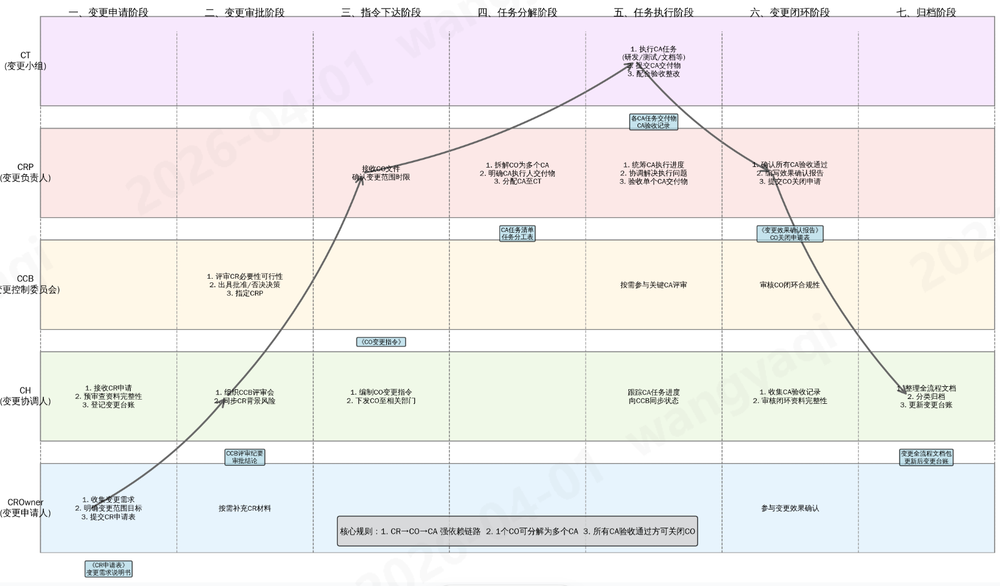
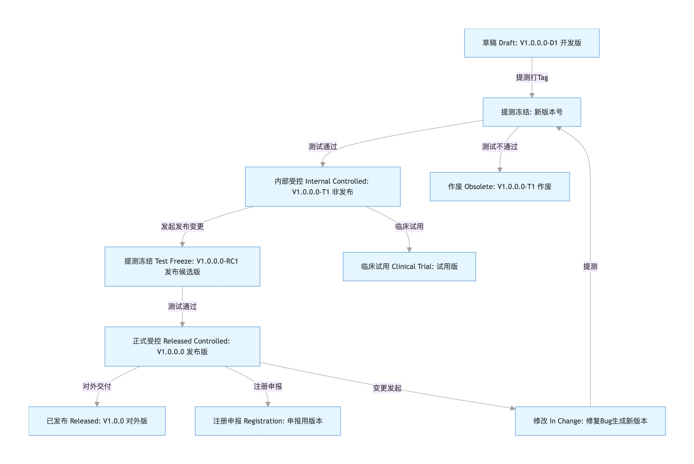

# 变更管理
## 术语
### 对象
| 术语 | 全称 | 说明 |
| - | - | - |
| CR | 变更请求 (Change Request) | 发起变更的正式申请，是变更流程的起点。 |
| CO | 变更指令 (Change Order) | 经CCB批准后，下达的正式变更执行指令。制定并会签《变更计划》，执行CA，关闭CO/CR。 |
| CA | 变更任务 (Change Action) | CO的具体执行动作，1个CO有N个CA。字段有类型(任务、新建文档、换版文档、作废文档)、责任人、时间节点、交付物、验收标准 |
| CP | 变更计划(Change Plan) | 属于CO，含N个CA |

### 流程
| 术语 | 全称 | 说明 |
| - | - | - |
| CCB | 变更控制委员会 (Change Control Board) | 由**质量、研发、生产、法规、供应链、设备、IT**等部门负责人/授权代表组成的**变更控制决策团队**，对**体系、产品、工艺、设备、研发等**所有变更进行评审和审批。 |
| CROwn er | 变更申请人 (Change Requester) | 发起变更请求的人员。需求类变更的申请人通常为产品经理，技术类变更的申请人通常为研发负责人。 |
| CRP | 变更负责人 (Change Responsible Person) | 由CCB为每个获批的变更指定的项目负责人，负责变更的策划、实施、确认及归档。确保变更的合规和风险管理。 |
| CT | 变更小组 (Change Team) | 由所有变更任务的实施者组成，且需包含至少一名QA成员，负责完成 CRP分配的变更任务。 |
| CH | 变更协调人(Change Handler) | 负责变更请求的登记与预审，安排CCB会议，存档变更及会议记录，跟踪变更流程并向CCB汇报，直至变更关闭。 |

### 变更申请表
| 分类 | 内容 |
| - | - |
| 变更基本信息 | 变更描述、变更对象（设备/软件型号、版本）、变更原因、变更内容（有修改前后的差异）、预期目标 |
| 变更影响 | 1. 影响和范围：产品型号、生产车间、客户群体、相关文档等   2. 影响评估：产品质量（性能、可靠性和安全性），生产流程，客户满意度，法规合规性 |
| 附加资料 | 变更需求说明书、技术方案(初步)、可行性分析报告、风险评估报告、变更项目计划(同项目管理) |

* 变更内容的类型
1. 用户需求
1. 研发优化：技术升级、性能提升、设计缺陷
1. 文档更新

## 变更流程
### 变更泳道图

1. CR审核批准前创建，CO在审核批准后创建。
1. 所有的CA执行完毕并验收通过，才能关闭CO。
1. CRP可以向CCB申请终止变更(比如需求不做了)。
1. 示例：CO是需求A的开发，其CA有研发、测试、文档/SOP/BOM更新、临床试用、发布、动物实验、升级、注册备案/变更。

### 流程
| 阶段 | 工作 | 工作内容 | 负责人 | 参与人员 |
| - | - | - | - | - |
| 变更发起 | 变更申请 | 提交变更申请表 | CROwner(研发/产品) | / |
| 变更等级和风险评估 | 变更等级和风险评估 | 基于《变更等级判定表》定变更等级 FMEA分析，输出《风险评估报告》 明确是否需要临床试用、注册申报 | 系统工程师 | 质量，临床，注册 |
| 变更评审与审批 | 变更评审与审批 | 评审内容：合规性(注册)、技术可行性、成本效益、风险可控性 审批结论：批准 / 附条件批准 / 否决 / 暂缓(无需新开CR)。批准后指定CRP下达CO | 小变更：研发团队   其他变更：CCB | 变更申请人，系统工程师 |
| 变更计划 | 制定变更计划 | 基于CO和《变更项目计划》，输出《变更计划》 | CRP | CT |
| 变更实施 | CA-开发 | 执行开发任务，输出产品 | 研发负责人 | / |
|  | CA-测试 | 执行验证任务，输出《验证报告》 | 测试工程师 | / |
|  | CA-产品受控 | 产品受控发布，纳入配置基线 | 研发 | / |
|  | CA-临床试用 | 小范围试用验证，输出《临床验证报告》 | CRB | / |
| 变更验证与确认 | 技术验证 | 复核变更实施的全流程结果，确认技术达标 产品符合需求 | 测试工程师 产品经理 | / |
|  | 临床确认 | 确认临床试用效果达标 | CRB | / |
| 合规申报 | CA-注册申报 | 中大变更向药监部门提交：中变更走变更备案，大变更走注册变更 | 注册 | / |
| 客户服务 | CA-客户升级方案制定 |  | 售后 | / |
|  | CA-设备A升级 |  | 售后 | / |
| 变更关闭与记录归档 | 变更关闭 | CRP提交《变更关闭确认书》，附 CR/CO/CA全流程材料 审核全流程材料完整性，签署《变更关闭确认书》，关闭CO(同时会关闭CR) | CH | / |
|  | 配置记录更新 | 同步更新至CMDB（配置管理数据库） | CH | / |
|  | 文档归档 | 整理归档所有材料：《变更申请表》《风险评估报告》《评审意见》《实施记录》《验证报告》等 保存期限：产品生命周期结束后5年 | CH | / |

### CA示例(软件发布→已销售一号机升级)
| CA编号 | 任务名称 | 责任人 | 核心交付物 | 验收标准 | 依赖关系 |
| - | - | - | - | - | - |
| CA-001 | 软件研发 | 研发工程师 | 软件包等 | / | 无前置依赖，直接启动 |
| CA-002 | 软件测试 | 测试工程师 | 测试报告 | / | CA-001完成 + 验收通过 |
| CA-003 | 软件受控 | 配置管理员 | 受控软件包、版本变更记录 | / | CA-002完成 + 验收通过 |
| CA-004 | 注册变更申报 | 注册专员 | 注册变更材料 | 取得药监部门备案回执或新注册证 | "变更验证与确认"通过 |
| CA-005 | 客户升级方案制定 | CRP + 售后工程师 | 升级操作手册、客户沟通函 | / | "变更验证与确认"通过 |
| CA-006 | 一号机现场升级与验证 | 售后工程师 | 现场升级记录、客户验收单 | 软件升级成功，设备运行稳定，客户签字确认 | CA-004完成 + CA-005完成 + 客户授权 |
| CA-007 | 升级后 72 小时客户跟踪 | 售后工程师 | 跟踪记录、客户反馈表 | 设备无异常，客户无负面反馈 | CA-006完成 |

## 实践
### 变更场景
| 项 | 场景 | 配置 | CA必需项 |
| - | - | - | - |
| 开发变更 | 仅开发功能/bugfix，不发布 | 不需要配置受控，不纳入公司正式配置基线 | 开发 |
| 发布变更 | 版本发布 | 纳入公司正式配置基线 | 测试，文档，配置受控，发布 |
| 系统升级变更 | 某个版本升级到某些系统实例 |  |  |
| 全变更(含以上所有变更) | 有个需求需要发布和升级 |  |  |
| 研发全变更(含开发变更和发布变更) | 有版本规划的1个迭代研发 |  |  |

* 开发变更
    * 版本规划好分成几次迭代(1个迭代是1个开发变更)，不在版本规划里的突发需求需要自己单独走开发变更。
    * 代码和文档有功能分支和tag。不合并到迭代版本。

### 版本场景
| 场景 | 版本号 | 示例 | 说明 |
| - | - | - | - |
| 对外使用 | 四段式 | V1.0.0.0 | 属于发布版本，对外使用有客户/生产/文档/铭牌 |
| 受控(发布) | 四段式 | V1.0.0.0 | 全流程追溯和配置管理。绑定测试、Bugfix、构建记录，满足药监检查要求 版本受控记录中写清转换关系：发布版本V1.0.0.0由测试版本V1.0.0.0-RC1验证通过后生成。 |
| 受控(非发布) | 四段式-后缀T | V1.0.0.0-T1 | 全流程追溯和配置管理。绑定测试、Bugfix、构建记录，满足药监检查要求 |
| 测试(发布候选) | 四段式-后缀RC | V1.0.0.0-RC1 | 版本用于发布，测试通过可发布 |
| 测试(非发布) | 四段式-后缀T | V1.0.0.0-T1 | 版本不用于发布。用途有单元测试，集成测试和系统测试等。相当于一轮提测。 提测即冻结：只要提测这个代码都不能改(打tag保证)，改代码必须升 Tx 版本号。 |

* 发布走标准版本号，非发布的标准版本号+后缀。后缀说明：
1. RC : 发布候选版
1. T : 内测版，不用于发布

### 版本和变更
* 首版：本质是包含N个需求的1个研发变更。
* 升级：
    1. 有版本规划的：包含N个需求的1个研发变更。
    1. 无版本规划的：1个需求的软硬件合起来走1个开发变更。

### 其他
1. 多个小需求可以一起走1个开发变更，降低走流程成本
1. 可行性分析评审通过了，就可以开始开发
1. 重评审，弱流程(保留流程的重点：可追溯，风险可控，合规)

## 资料
### 变更等级
| 变更等级 | 判定标准 | 举例 |
| - | - | - |
| 微小 | 不影响产品安全性、有效性，无临床风险 | 软件界面文字修改、设备常规保养参数微调、文档格式优化 |
| 中度 | 对产品性能有一定影响，但风险可控，不改变核心功能 | 软件非核心功能优化、设备次要部件更换、常规参数调整 |
| 重大 | 影响核心功能、临床诊断 / 治疗效果，或需满足监管报备要求 | 医疗器械软件核心算法修改、设备关键性能参数调整、诊断标准变更 |

### 变更评审流程
| 变更等级 | 评审人员 | 流程 |
| - | - | - |
| 微小 | 研发 / 质量 | 无需上会，直接审核《变更申请表》，确认无风险后批准 |
| 中度 | CCB（技术评审） | CCB |
| 重大 | CCB（临床安全评审 + 技术评审） | CCB |

### 变更后监控与审计
1. 日常监控：变更后1-3个月内，跟踪产品/系统运行状态，收集临床反馈，及时处理潜在问题
1. 配置审计：定期核查实际配置与CMDB记录一致性，确保无非授权变更